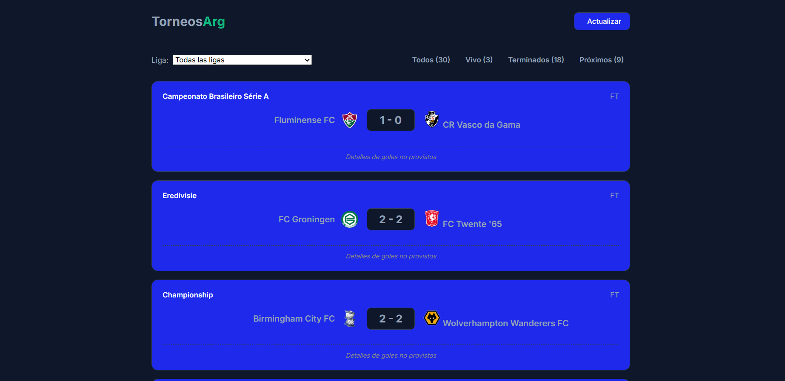
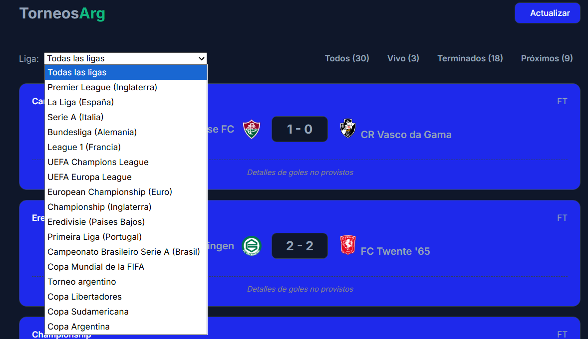

🌐 TorneosArg
Página para poder comprobar los resultados y horarios de los partidos de fútbol diarios.

🚀 Tecnologías utilizadas
HTML5
CSS3
JavaScript
PHP

🖥️ Vista del sitio
Página principal

Selección de ligas

🌍 Demo
Podés probar la aplicación online:

👉 Ver sitio web
https://torneosarg.infinityfree.io/

👨‍💻 Autor
Axel Leguero

GitHub: @AxelOP96
LinkedIn: https://www.linkedin.com/in/axel-leguero
📄 Licencia
Este proyecto está bajo la licencia MIT.

⭐ Si este proyecto te resultó útil, considerá darle una estrella al repositorio.